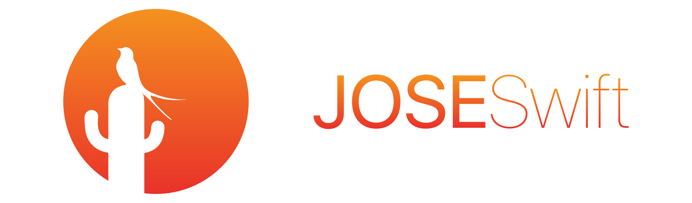

<br>

**JOSESwift** is a modular and extensible framework for the [JOSE](https://datatracker.ietf.org/wg/jose/about/) standards [**JWS**](https://tools.ietf.org/html/rfc7515), [**JWE**](https://tools.ietf.org/html/rfc7516), and [**JWK**](https://tools.ietf.org/html/rfc7517) written in Swift. 
It is designed with usage on iOS and pure Swift environments in mind.

[](https://travis-ci.org/airsidemobile/JOSESwift)

As of now, usage is limited to iOS. See [Security](#security) for details.

> :bulb: Please note that this implementation of the JOSE standards is not fully complete yet. For example, there is only a limited set of supported algorithms available at the moment. Moreover we currently only support compact serialization of JOSE types. If you are missing a specific feature, algorithm, or serialization, feel free to [submit a pull request](#contributing).

## Contents

- [Features](#features)
- [Installation](#installation)
	- [CocoaPods](#cocoapods)
	- [Carthage](#carthage)
	- [Swift Package Manager](#swift-package-manager)
- [Usage](#usage)
	- [JWS: Digital Signatures](#jws-digital-signatures)
	- [JWE: Encryption and Decryption](#jwe-encryption-and-decryption)
	- [JWK: Representing Keys](#jwk-representing-keys)
- [Security](#security)
- [Contributing](#contributing)
- [Resources](#resources)
- [Contact](#contact)
- [Credits](#credits)
- [License](#license)

## Features

If you are missing a specific feature, algorithm, or serialization, feel free to [submit a pull request](#contributing).

### General

*Supported serializations:*

| Compact Serialization | JSON Serialization |
| :-------------------: | :----------------: |
| :white_check_mark:    |                    |

### JWS :pencil:

Digitally signing and verifying arbitrary data using the JWS standard.

*Supported algorithms:*

| HS256 | HS384 | HS512 | RS256 | RS384 | RS512 | ES256 | ES384 | ES512 | PS256  | PS384 | PS512 |
| :--: | :--: | :--: | :--: | :--: | :--: | :--: | :--: | :--: | :--: | :--: | :--: |
| | | | :white_check_mark: | | :white_check_mark: | | | | | | |

### JWE :lock:

Encrypting and decrypting arbitrary data using the JWE standard.

*Supported key encryption algorithms:*

| RSA1_5 | RSA-OAEP | RSA-OAEP-256 | A128KW | A192KW | A256KW | dir | ECDH-ES | ECDH-ES+A128KW | ECDH-ES+A192KW | ECDH-ES+A256KW | A128GCMKW | A192GCMKW | A256GCMKW | PBES2-HS256+A128KW | PBES2-HS384+A192KW | PBES2-HS512+A256KW |
| :--: | :--: | :--: | :--: | :--: | :--: | :--: | :--: | :--: | :--: | :--: | :--: | :--: | :--: | :--: | :--: | :--: | 
| :white_check_mark: | | | | | | | | | | | | | | | | |

*Supported content encryption algorithms:*

| A128CBC-HS256 | A192CBC-HS384 | A256CBC-HS512 | A128GCM | A192GCM | A256GCM |
| :--: | :--: | :--: | :--: | :--: | :--: |
| | | :white_check_mark: | | | |

### JWK :key:

Encoding and decoding RSA public key data in PKCS#1 format as well as iOS `SecKey`s.

*Supported key types:*

| EC | RSA | oct |
| :--: | :--: | :--: |
| | :white_check_mark: | |

## Installation

### CocoaPods

To integrate JOSESwift into your Xcode project, include it in your `Podfile`:

``` ruby
source 'https://github.com/CocoaPods/Specs.git'
platform :ios, '10.0'
use_frameworks!

target '<Your Target Name>' do
    pod 'JOSESwift'
end
```

Then install it by running `pod install`. More documentation on using CocoaPods can be found [here](https://cocoapods.org).

### Carthage

To integrate JOSESwift in your Xcode project, include it in your `Cartfile`:

```
github "airsidemobile/JOSESwift"
```

Then build it by running `carthage update` and drag the built framework into your Xcode project. More documentation on using Carthage can be found [here](https://github.com/Carthage/Carthage).

## Usage

JOSESwift covers three functional aspects:

1. [JWS: Digital Signatures](#jws-digital-signatures)
	- [Signing data](#signing-data)
	- [Verifying data](#verifying-data)
2. [JWE: Encryption and Decryption](#jwe-encryption-and-decryption)
	- [Encrypting data](#encrypting-data)
	- [Decrypting data](#decrypting-data)
3. [JWK: Representing Keys](#jwk-representing-keys)
	- [Encoding RSA Public Keys](#encoding-rsa-public-keys)
	- [Decoding RSA Public Keys](#decoding-rsa-public-keys)

****

### JWS: Digital Signatures

A `JWS` encapsulates and secures data using a digital signature which can be verified by the receiver of the `JWS`.

#### Signing Data

In order to construct a JWS we need to provide the following parts:

1. Header
2. Payload
3. Signature

``` swift
let privateKey: SecKey = /* ... */

let message = "Summer ⛱, Sun ☀️, Cactus 🌵".data(using: .utf8)!
```

``` swift
let header = JWSHeader(algorithm: .RS512)

let payload = Payload(message)

// Signer algorithm must match header algorithm.
let signer = Signer(signingAlgorithm: .RS512, privateKey: privateKey)!
```

``` swift
guard let jws = try? JWS(header: header, payload: payload, signer: signer) else { ... }

print(jws.compactSerializedString) // ey (...) J9.U3 (...) LU.na (...) 1A
```  

The JWS compact serialization is a URL-safe string that can easily be transmitted to a third party using a method of your choice.

More details about constructing a JWS can be found [in the wiki](../../wiki/jws).

#### Verifying Data

``` swift
let publicKey: SecKey = /* ... */

let serialization = "ey (..) n0.HK (..) pQ.yS (..) PA.AK (..) Jx.hB (..) 7w"
```

``` swift
do {
    let jws = try JWS(compactSerialization: serialization)
    let payload = try jws.validate(with: publicKey).payload
    let message = String(data: payload.data(), encoding: .utf8)!

    print(message) // Summer ⛱, Sun ☀️, Cactus 🌵
}
```

More details about verifying an existing, serialized JWS can be found [in the wiki](../../wiki/jws).

****

### JWE: Encryption and Decryption

A JWE encapsulates and secures data by encrypting it. It can be decrypted by the receiver of the JWE.

#### Encrypting Data

In order to construct a JWE we need to provide the following parts:

1. Header
2. Plaintext
3. Encrypter

``` swift
let publicKey: SecKey = /* ... */

let message = "Summer ⛱, Sun ☀️, Cactus 🌵".data(using: .utf8)!
```

``` swift
let header = JWEHeader(algorithm: .RSA1_5, encryptionAlgorithm: .A256CBCHS512)

let payload = Payload(message)

// Encrypter algorithms must match header algorithms.
let encrypter = Encrypter(keyEncryptionAlgorithm: .RSA1_5, keyEncryptionKey: publicKey, contentEncyptionAlgorithm: .A256CBCHS512)!
```

``` swift
guard let jwe = try? JWE(header: header, payload: payload, encrypter: encrypter) else { ... }

print(jwe.compactSerializedString) // ey (..) n0.HK (..) pQ.yS (..) PA.AK (..) Jx.hB (..) 7w
```  

The JWE compact serialization is a URL-safe string that can easily be transmitted to a third party using a method of your choice.

More details about constructing a JWE can be found [in the wiki](../../wiki/jwe).

#### Decrypting Data

``` swift
let privateKey: SecKey = /* ... */

let serialization = "ey (..) n0.HK (..) pQ.yS (..) PA.AK (..) Jx.hB (..) 7w"
```

``` swift
do {
    let jwe = try JWE(compactSerialization: serialization)
    let payload = try jwe.decrypt(with: privateKey)
    let message = String(data: payload.data(), encoding: .utf8)!

    print(message) // Summer ⛱, Sun ☀️, Cactus 🌵
}
```

More details about decrypting an existing, serialized JWE can be found [in the wiki](../../wiki/jwe).

****

### JWK: Representing Keys

A JWK is a JSON data structure that represents a cryptographic key. You could use it, for instance, as the payload of a JWS or a JWE to transmit your public key to a server.

#### Encoding RSA Public Keys

``` swift
let publicKey: SecKey = /* ... */

let jwk = try! RSAPublicKey(publicKey: publicKey)

let json = jwk.jsonString()! // {"kty":"RSA","n":"MHZ4L...uS2d3","e":"QVFBQg"}
```

More details about encoding RSA public keys can be found [in the wiki](../../wiki/jwk).

#### Decoding RSA Public Keys

``` swift
let json: Data = /* ... */

let jwk = try! RSAPublicKey(data: json)

let publicKey: SecKey = try! jwk.converted(to: SecKey.self)
```

More details about decoding RSA public keys can be found [in the wiki](../../wiki/jwk).

## Security

JOSESwift uses the [iOS Security framework](https://developer.apple.com/documentation/security) and [Apple’s CommonCrypto](https://opensource.apple.com//source/CommonCrypto/) for cryptography.

It is designed in a way that it is easy to switch out the implementation for a specific cryptographic operation. Non-iOS users can add their own platform independent crypto implementation instead of the ones mentioned above.

For security disclosures or related matters, please contact <joseswift@airsidemobile.com>.

## Contributing

Contributions to the project are encouraged and more than welcome. :nerd_face:

If you want to contribute, please submit a pull request. 
For feature requests, discussions, or bug reports, just open an issue.

See our [contributing guidelines](.github/CONTRIBUTING.md) for more information.

## Resources

You can find detailed information about the relevant JOSE standards in the respective RFCs:

- [RFC-7515:](https://tools.ietf.org/html/rfc7515) JSON Web Signature (JWS)
- [RFC-7516:](https://tools.ietf.org/html/rfc7516) JSON Web Encryption (JWE)
- [RFC-7517:](https://tools.ietf.org/html/rfc7517) JSON Web Key (JWK)
- [RFC-7518:](https://tools.ietf.org/html/rfc7518) JSON Web Algorithms (JWA)

Don’t forget to check our [our wiki](https://github.com/mohemian/jose-ios/wiki) for more detailed documentation.

## Contact

Feel free to contact the project maintainers at <joseswift@airsidemobile.com>.

## Credits

JOSESwift is maintained by [Airside Mobile](https://www.airsidemobile.com).

### Project Authors and Maintainers

[@carol-mohemian](https://github.com/carol-mohemian),
[@daniel-mohemian](https://github.com/daniel-mohemian),
[@gigi-mohemian](https://github.com/gigi-mohemian)

### Reviewers

[@haeser](https://github.com/haeser), [@michael-mohemian](https://github.com/michael-mohemian)

### Logo

The logo was designed by Ivan Leuzzi.

### Thanks

To the following projects, which served us as reference and inspiration during development:

- [Heimdall](https://github.com/henrinormak/Heimdall)
- [Nimbus JOSE + JWT](https://connect2id.com/products/nimbus-jose-jwt)

## License

JOSESwift is licensed under the Apache License 2.0. See [LICENSE](LICENSE) for details.
